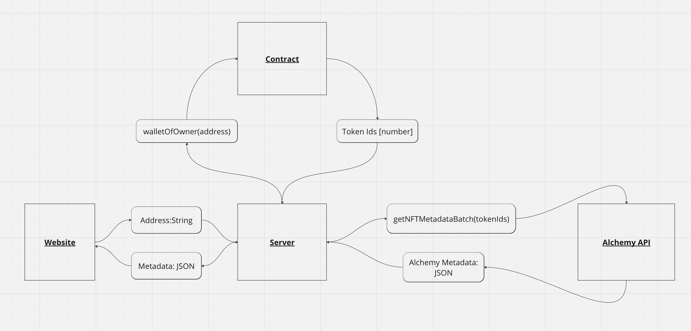

# NFT VIEWER

## Getting Started

1. Open two terminals at the root directory at this folder
2. In one run `cd server && node app.js`
3. In the other run `cd website && npm run dev`
4. Open the next.js site and input an Ethereum address to see their Pudgy Penguin holdings

`0x29469395eAf6f95920E59F858042f0e28D98a20B` has 340 Pudgy Penguins

`0xcce98763ff5a9Ff5bAF8b15aBC456077a1e84f2A` has 1 Pudgy Penguin

## System

## Work Flow

1. User inputs an address into website
2. Website sends address to server
3. Server calls contract to get token ids for wallet
4. Server creates Alchemy request with those token ids
5. Alchemy responds with metadata for token ids
6. Server parses response and sends relevant information to website